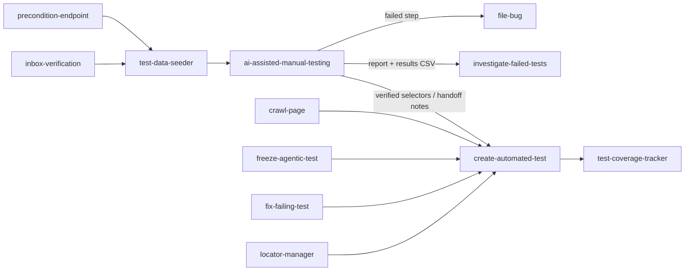

# QA AI Skills

**A library of tool-agnostic AI agent skills for software QA and testing** — manual test execution
with real evidence, test data, bug reporting, failure triage, test automation and coverage tracking.

Each skill is a plain Markdown instruction file (`SKILL.md`) that an AI coding agent loads and
follows. They work with any web, mobile, desktop, API or CLI application, any test-case tracker,
and any document format that can hold text and images.

> **AI speeds up QA. It does not replace it.** Every skill here produces output that a human
> reviews before anyone acts on it. No skill files bugs, merges code or changes shared records
> without a person deciding to.

---

## Contents

- [Why these skills](#why-these-skills)
- [Skill catalog](#skill-catalog)
- [How the skills fit together](#how-the-skills-fit-together)
- [Quick start](#quick-start)
- [Configuration](#configuration)
- [Evidence output formats](#evidence-output-formats)
- [Design principles](#design-principles)
- [Repository layout](#repository-layout)
- [Security and privacy](#security-and-privacy)
- [Contributing](#contributing)
- [Project status](#project-status)
- [License](#license)

---

## Why these skills

Ask a general-purpose AI agent to "test this ticket" twice and you get two different results:
different step counts, different verdicts, a different report layout, screenshots of loading
spinners, and the occasional confident PASS on something it never actually saw.

These skills exist to make AI-assisted QA **repeatable and reviewable**:

- **Code decides, the model observes.** Step lists, verdicts and report layouts come from fixed
  rules and scripts, not from the model's judgement on the day.
- **Evidence or it didn't happen.** Every executed step has a screenshot (or an API/terminal
  transcript) taken *when the expected state is on screen*, not after an arbitrary sleep.
- **Honest verdicts.** Steps nobody could observe are `blocked`, not quietly passed. Unmet
  preconditions are `INCONCLUSIVE`, not reported as product failures.
- **Bring your own tools.** Jira or TestRail, Playwright or Appium, Word or Google Sheets — the
  skills are configured, not rewritten.

---

## Skill catalog

| Skill | What it does | Status |
|---|---|---|
| [**ai-assisted-manual-testing**](skills/ai-assisted-manual-testing/SKILL.md) | Runs a manual test case with an AI agent driving the app, captures annotated before/after evidence for every step, and publishes a reviewer-ready report as Google Docs, Word, Excel, Google Sheets, PDF, HTML, Markdown and more. Runs many targets in parallel as independent sub-agents. | ✅ Available |
| **test-data-seeder** | Creates ready-to-use test accounts and data for a given test case — account creation, email verification, password setup, terms acceptance, products/fixtures — and records them for other skills to pick up. | 🗺️ Planned |
| **file-bug** | Turns a failed step from an evidence report (or a described failure) into a bug ticket using a standard template, with screenshots embedded inline — drafted for a human to approve, never auto-filed. | 🗺️ Planned |
| **investigate-failed-tests** | Explains why a test cycle's failures failed and classifies each one: product defect (filed / unfiled), test data, automation script, stale test case or environment. Hands back a paste-ready notes column. | 🗺️ Planned |
| **fix-failing-test** | Triages a red automated test or CI job and proposes an exact, root-caused fix — diagnose and propose only, no edits. | 🗺️ Planned |
| **create-automated-test** | Generates an automated test (e.g. Gherkin feature + step definitions) from a test case and runs it until it passes or fails for a real reason. | 🗺️ Planned |
| **freeze-agentic-test** | Compiles a natural-language / agent-driven test into a deterministic one with real selectors, so it runs in CI for free and the same way every time. | 🗺️ Planned |
| **crawl-page** | Captures multi-state knowledge of a page or screen (elements, selectors, states, gotchas) for test authoring and future runs. | 🗺️ Planned |
| **locator-manager** | Creates, updates and inspects locators in a central object repository, and keeps the local cache in sync. | 🗺️ Planned |
| **test-coverage-tracker** | Marks test cases Automated / Manual / For automation on a test board, and reports which cases already have automated coverage. | 🗺️ Planned |
| **test-assignment** | Assigns, reassigns and splits test cases between testers on a test board. | 🗺️ Planned |
| **precondition-endpoint** | Spots state set-up that manual runs keep doing by hand and turns it into a reusable API operation, so preconditions become one call instead of a throwaway script. | 🗺️ Planned |
| **inbox-verification** | Clears verification emails sent to test inboxes (registrations, domain/registrant checks) by finding and visiting each link, then reporting what was verified. | 🗺️ Planned |

Want one of the planned skills sooner? Open an issue — or see [Contributing](#contributing).

---

## How the skills fit together



A typical cycle: seed an account → run the manual test with evidence → file or link bugs for
failures → investigate the cycle's failures → automate the stable cases → mark them automated.

---

## Quick start

### 1. Get the skills

```bash
git clone https://github.com/<your-org>/<this-repo>.git
```

### 2. Install a skill into your agent

**Claude Code**
```bash
mkdir -p .claude/skills/ai-assisted-manual-testing
cp <this-repo>/skills/ai-assisted-manual-testing/SKILL.md .claude/skills/ai-assisted-manual-testing/
```
Then run it as `/ai-assisted-manual-testing PROJ-142`, or just ask: *"run manual test PROJ-142 and
give me a Word report"*.

**Other agents** (Cursor, Codex, Gemini CLI, Copilot, Windsurf, …) — the skills are plain Markdown.
Add the `SKILL.md` to whatever your agent reads for project instructions (rules files,
`AGENTS.md`, custom instructions) or reference it from there.

### 3. Install the runtime dependencies you need

| For | Install |
|---|---|
| Web testing | Node.js 18+, `npm i -D playwright` and `npx playwright install` |
| Mobile testing | Appium 2 + platform drivers, Android SDK / Xcode |
| Word / Excel reports | Python 3.9+, `pip install python-docx openpyxl` |
| Google Docs / Sheets | `npm i googleapis` (or a Google Drive MCP server) + OAuth credentials |
| PDF / ODT conversion | Playwright (`page.pdf()`), or `pandoc` / LibreOffice |

### 4. Add a config file

Create `qa-testing.config.yaml` at your repo root (see below), put credentials in environment
variables, and add the working directory to `.gitignore`:

```gitignore
.qa-runs/
*_capture*.mjs
*_probe*.mjs
```

### 5. Run one test case interactively first

Review the report, fix any selectors, and add `assert`s to the steps whose verdict drifted. Then let
it run many targets in parallel.

---

## Configuration

All project-specific details live in one file. Nothing in the skills hard-codes a product, URL,
tracker or account. Minimal example:

```yaml
project: "My Product"

testCaseSource:
  type: jira                 # jira | azure-devops | testrail | github | gitlab | linear | clickup | notion | sheet | file | inline
  baseUrl: https://example.atlassian.net

environments:
  staging: { kind: web, baseUrl: https://staging.example.com }
defaultEnvironment: staging

accounts:
  - id: basic-user
    usernameEnv: QA_BASIC_USER     # env var NAMES only — never the secret itself
    passwordEnv: QA_BASIC_PASS

output:
  formats: [docx, gdoc]
  destination: { type: local, dir: ./test-evidence/{cycle} }
  redact: ['input[type="password"]', '[data-sensitive]']

results:
  csv: ./manual-test-results.csv
  commentOnTestCase: true
```

The full schema is documented in each skill's `SKILL.md`.

---

## Evidence output formats

| Format | How it's built |
|---|---|
| Microsoft Word (`.docx`) | `python-docx` / `docx` (npm) / pandoc |
| Google Docs | `.docx` uploaded to Drive with conversion (images preserved) |
| Microsoft Excel (`.xlsx`) | `openpyxl` / `exceljs` — Summary sheet + one row per step with images |
| Google Sheets | `.xlsx` uploaded with conversion (verify images), or Apps Script |
| PDF | HTML report printed with a headless browser, or pandoc / LibreOffice |
| HTML | Single self-contained file (embedded images) or page + `images/` |
| Markdown | `report.md` + `images/` |
| OpenDocument (`.odt` / `.ods`) | Converted from `.docx` / `.xlsx` with LibreOffice |
| Confluence / Notion / wiki | Images uploaded as attachments, then the page body |

Every format is rendered from the same evidence file, so a Word report and a Google Sheet of the
same run contain the same steps, verdict and images in the same order.

---

## Design principles

Every skill in this repository follows these rules. New skills must too.

1. **Code decides, the model observes.** Anything that should be the same every run — step lists,
   verdicts, report layout, file naming — is decided by a script or a fixed rule.
2. **One test-case step = one report step.** Never merged, split, renumbered or dropped. A step
   that can't run is reported as `blocked` with the reason.
3. **Screenshot on a condition, never on a timer.** Capture waits for the element that proves the
   step; if it never appears, the step is `blocked` — honestly.
4. **Waits use a ladder:** 30 s, then one 60 s retry, then fail. Short waits create false failures
   *and* false passes.
5. **Rule out impostors before reporting a failure:** unmet preconditions, missed transient
   messages, and states sampled only once.
6. **Verdicts can be made stricter, never looser.** Any `failed` step → FAILED; any blocked or
   skipped step → INCONCLUSIVE.
7. **Humans make the consequential calls.** Skills draft bugs and propose fixes; people file and
   apply them.
8. **Parallel runs are isolated.** One sub-agent per target, its own browser, its own files, and
   no shared state between siblings.
9. **No hand-built fallbacks.** If the report can't be built and verified by the renderer, the run
   stops with a clear error instead of producing a doc that looks right but isn't.

---

## Repository layout

```
.
├── README.md
├── LICENSE
├── CONTRIBUTING.md
├── skills/
│   ├── ai-assisted-manual-testing/
│   │   ├── SKILL.md              # the skill itself
│   │   ├── references/           # optional deep-dive docs loaded on demand
│   │   └── scripts/              # optional helpers (capture kit, renderers)
│   └── <next-skill>/
│       └── SKILL.md
└── examples/
    ├── qa-testing.config.yaml    # sample configuration
    └── sample-report/            # example evidence reports in each format
```

---

## Security and privacy

- **Credentials never leave environment variables.** They are not written to config, logs,
  results files, screenshots, reports or comments.
- **Screenshots are redacted** using the `output.redact` selectors (password fields, card numbers,
  personal data). Review reports before sharing them outside your team.
- **Login screens are not photographed** unless the test case is about authentication.
- **Read-only environments are respected.** Mark production or shared environments
  `readOnly: true` and mutating steps are blocked rather than executed.
- **Temporary public uploads** (used by some cloud document APIs to embed images) are deleted in a
  `finally` block, even when a build crashes.
- AI agents send page content and screenshots to the model provider you configure. Don't point
  these skills at systems whose data may not leave your organisation without checking your policy.

Found a security issue? Please report it privately (see `SECURITY.md`) rather than opening a public
issue.

---

## Contributing

Contributions are welcome — new skills, new output adapters, new test-case source integrations,
and fixes.

1. **Open an issue first** for a new skill, describing the QA problem it solves.
2. **Keep it tool-agnostic.** No company names, internal URLs, hostnames, account IDs or
   product-specific selectors. Anything project-specific goes in the config file.
3. **Follow the [design principles](#design-principles).** Especially: decisions that must be
   repeatable belong in code, not in the model's judgement.
4. **Structure:** a `SKILL.md` with YAML frontmatter (`name`, `description`), then sections for
   inputs, pipeline, rules for close calls, and fixed defaults for every situation where an
   unattended agent would otherwise have to ask.
5. **Test it on a real run** and include a sample output (with any sensitive data removed) in
   `examples/`.

---

## Project status

**Early.** The skill instructions are complete; the embedded reference code (capture helpers,
Word/Excel renderers, upload snippets) is a starting point and should be validated in your
environment before you rely on it. Feedback from real test runs is the most useful contribution
right now.

---

## License

Released under the [MIT License](LICENSE).

AI-generated test evidence must be reviewed by a qualified person before it is used to make
release, compliance or customer-facing decisions. This software is provided "as is", without
warranty of any kind.
